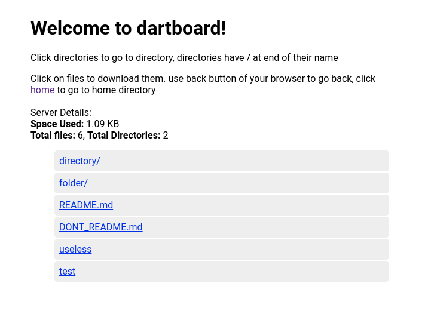

# API

## ReST

### `/api/count GET`

Returns count of files and directories as json.
example:

```json
{
  "files": 6,
  "directories": 3
}
```

### `/api/space-used GET`

Returns space used by all the files
example:

```json
{
  "bytesUsed": 1118,
  "humanReadable": "1.09 KB"
}
```

## Pages

### `/dir/<path/to/directory> GET`

Renders a page of directory contents, directories followed by files
Directories are marked by trailing `/`

How it's supposed to look like. We also fetch the total files after a delay of 1.5seconds and directories through <del>js</del> dart using ReST APIs mentioned above.


### `/`

This redirects us to `/dir`

## Downloads
### `/files/<path/to/file> GET`
Files are downloaded through this link every `'file'` in directory page is an anchor/link pointing to this, hence you can download the file by clicking the file entry on directory page.

This passes `Content-Disposition: attachment` in header hence download will start.

## Static
### `/static/<path/to/file> GET`
Delivers static files like `index.css`, `index.dart.js` inline
